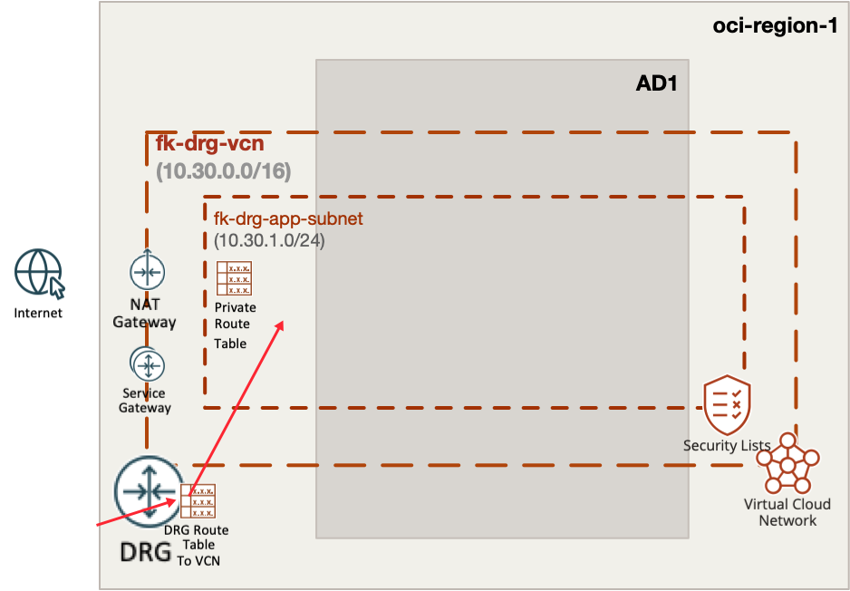
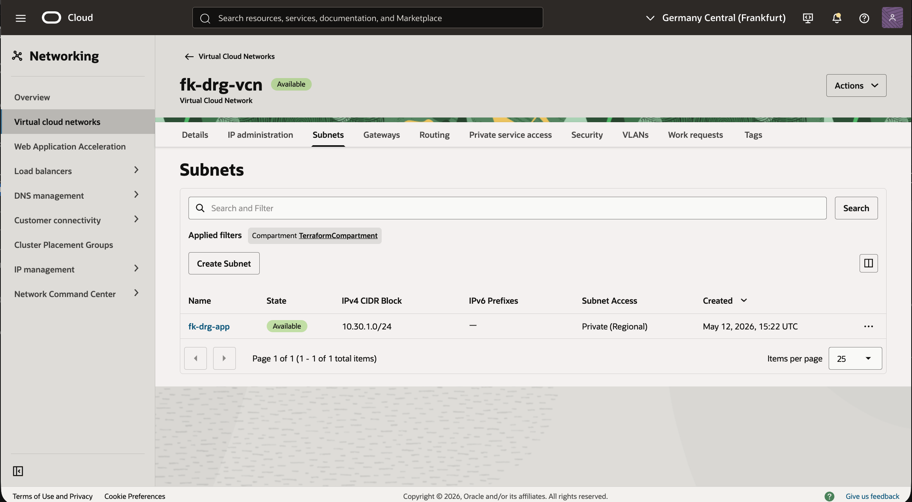
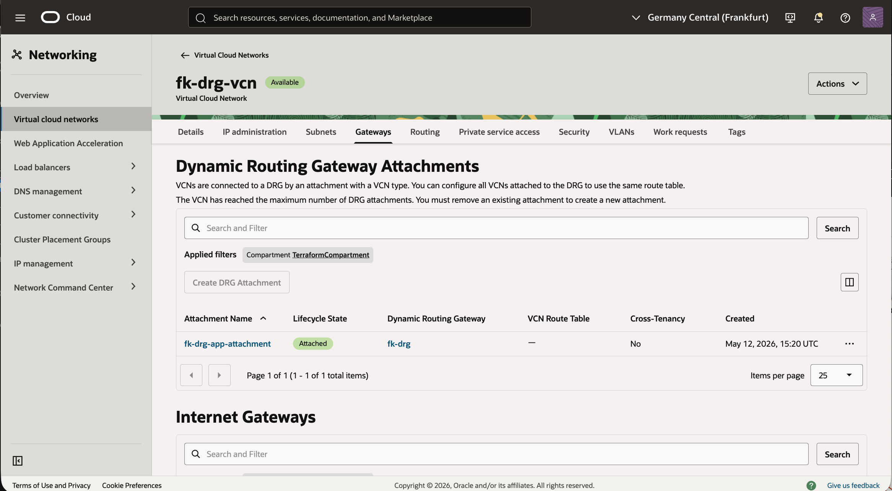
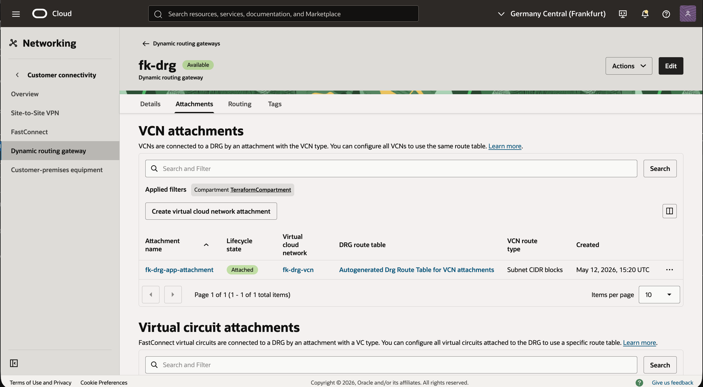

# Example 01: Basic DRG VCN Attachment

In this example, we deploy **one Oracle Cloud Infrastructure (OCI) Virtual Cloud Network (VCN)** and attach it to a **Dynamic Routing Gateway (DRG)** using Terraform/OpenTofu.

This is the foundational DRG scenario in OCI and a natural starting point before building remote peering, transit routing, or hybrid connectivity.

---

## 🧭 Architecture Overview



This deployment creates:

- One VCN in a single OCI region:
  - `fk-drg-vcn` (`10.30.0.0/16`)
- One private subnet:
  - `fk-drg-app` (`10.30.1.0/24`)
- One DRG
- One VCN attachment connecting the VCN to the DRG
- One DRG route table with a route back to the attached VCN

This example does **not** yet create a live remote network on the other side.
Instead, it establishes the DRG foundation and shows how a reusable VCN can be attached cleanly to a DRG before more advanced routing scenarios are layered on top.

---

## 🚀 Deployment Steps

Initialize and apply the Terraform/OpenTofu configuration:

```bash
cp terraform.tfvars.example terraform.tfvars
tofu init
tofu plan
tofu apply
```

After a successful deployment, Terraform will output:

- the VCN ID
- the DRG ID
- the DRG attachment IDs
- the DRG route table IDs

---

## 🖼️ OCI Console View

Below you can see the resulting VCN, DRG attachment, and DRG route table
as displayed in the OCI Console:



This view confirms that `fk-drg-vcn` was created successfully
with the private subnet `fk-drg-app` in the expected CIDR range.



This screen shows the VCN-to-DRG attachment.
It confirms that `fk-drg-vcn` is attached to DRG `fk-drg`
and ready for DRG-based connectivity patterns.



This view shows the DRG route table and its static route
back to `10.30.0.0/16` through the VCN attachment.
That is the key DRG-side routing element created by this example.

---

## 🖼️ OCI Console Verification

After deployment, verify the following in OCI Console:

### VCN
- `fk-drg-vcn` with CIDR `10.30.0.0/16`
- subnet `fk-drg-app` with CIDR `10.30.1.0/24`
- private route table containing NAT and Service Gateway routing for the private subnet

### DRG
- one DRG named `fk-drg`
- one VCN attachment attached to `fk-drg-vcn`
- one DRG route table with a route back to `10.30.0.0/16` through the VCN attachment

This confirms that the DRG foundation is in place and ready to be extended with remote connectivity.

---

## 🧠 Design Notes

- DRG is the strategic OCI primitive for remote and transit connectivity
- VCN route tables and DRG route tables are separate concerns and both matter
- In a single self-contained example like this one, it is cleaner to establish the attachment first and layer remote DRG routing in later scenarios
- This example keeps VCN construction inside `terraform-oci-fk-vcn`
- DRG resources and DRG-side routing stay inside `terraform-oci-fk-drg`

This is a practical building block for:

- remote VCN peering
- hybrid connectivity foundations
- DRG transit routing labs

---

## 🧹 Cleanup

To remove all resources created by this example:

```bash
tofu destroy
```

---

## ✅ Summary

This example demonstrates:

- how to create a DRG in OCI
- how to attach a VCN to that DRG
- how to model DRG-side routes back to the attached VCN
- how to compose `terraform-oci-fk-vcn` with `terraform-oci-fk-drg`

---

## 🌐 Learn More

Visit [FoggyKitchen.com](https://foggykitchen.com/) for OCI, multicloud, and Terraform/OpenTofu learning resources.

---

## 🪪 License

Licensed under the **Universal Permissive License (UPL), Version 1.0**.  
See [LICENSE](../../LICENSE) for more details.
