# Example 02: Cross-Region DRG Remote Peering

In this example, we deploy **two Oracle Cloud Infrastructure (OCI) Virtual Cloud Networks (VCNs)** in **two different OCI regions** and connect them using **two Dynamic Routing Gateways (DRGs)** and **Remote Peering Connections (RPCs)**.

This is the first cross-region scenario for the module and the natural next step after the single-region DRG attachment shown in example `01`.

---

## 🧭 Architecture Overview

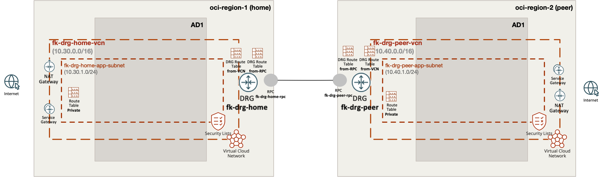

This deployment creates:

- One VCN, one subnet, one DRG, and one RPC in the home region
- One VCN, one subnet, one DRG, and one RPC in the peer region
- One VCN attachment on each DRG
- One RPC attachment management object on each DRG
- Two DRG route tables per region:
  - `from-vcn` for traffic entering the DRG from the local VCN
  - `from-rpc` for traffic entering the DRG from the remote region
- VCN route table entries that send cross-region traffic to the local DRG

The example keeps VCN construction inside `terraform-oci-fk-vcn` and DRG/RPC composition inside `terraform-oci-fk-drg`.

---

## 🚀 Deployment Steps

Initialize and apply the Terraform/OpenTofu configuration:

```bash
cp terraform.tfvars.example terraform.tfvars
tofu init
tofu plan
tofu apply
```

Before applying, make sure:

- both `home_region` and `peer_region` are subscribed in your OCI tenancy
- the chosen compartment is available in both regions
- your OCI IAM policies allow DRG, RPC, VCN, subnet, and route table management in both regions

After a successful deployment, Terraform will output:

- both VCN IDs
- both DRG IDs
- both DRG attachment ID maps
- both DRG route table ID maps
- both RPC ID maps

---

## 🖼️ OCI Console Verification

After deployment, verify the following in OCI Console:

### Home Region
- `fk-drg-home-vcn` with CIDR `10.30.0.0/16`
- subnet `fk-drg-home-app` with CIDR `10.30.1.0/24`
- DRG `fk-drg-home`
- RPC `fk-drg-home-rpc`
- DRG route table `from-vcn` with a route to `10.40.0.0/16` through the RPC attachment
- DRG route table `from-rpc` with a route to `10.30.0.0/16` through the VCN attachment

### Peer Region
- `fk-drg-peer-vcn` with CIDR `10.40.0.0/16`
- subnet `fk-drg-peer-app` with CIDR `10.40.1.0/24`
- DRG `fk-drg-peer`
- RPC `fk-drg-peer-rpc`
- DRG route table `from-vcn` with a route to `10.30.0.0/16` through the RPC attachment
- DRG route table `from-rpc` with a route to `10.40.0.0/16` through the VCN attachment

### End-to-End
- the RPC peering state is established
- both VCN private route tables contain a route to the remote VCN CIDR through the local DRG

This confirms that traffic can be forwarded from one VCN into its local DRG, across the RPC peering, and back out through the remote DRG attachment.

Below is a full console walkthrough showing the exact resources and routing objects created by the example.

### Home Region Screenshots

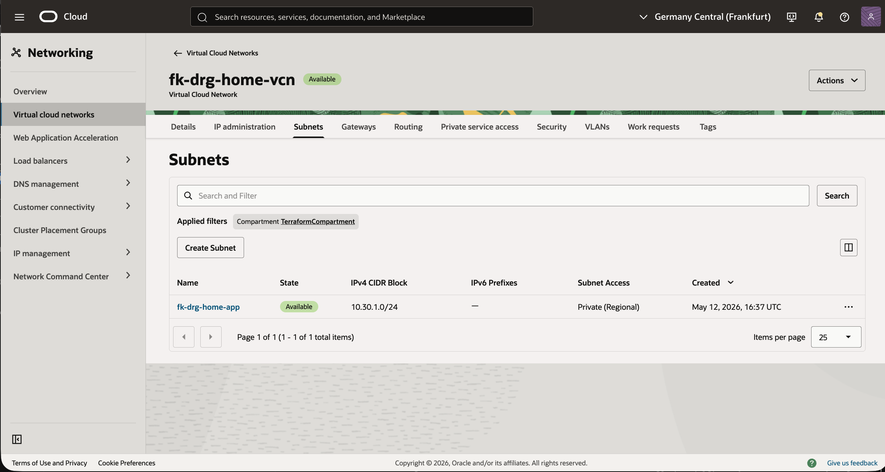

This view shows the home-region VCN `fk-drg-home-vcn` and the private subnet `fk-drg-home-app`. It confirms that the first region uses the expected `10.30.0.0/16` and `10.30.1.0/24` CIDR layout.

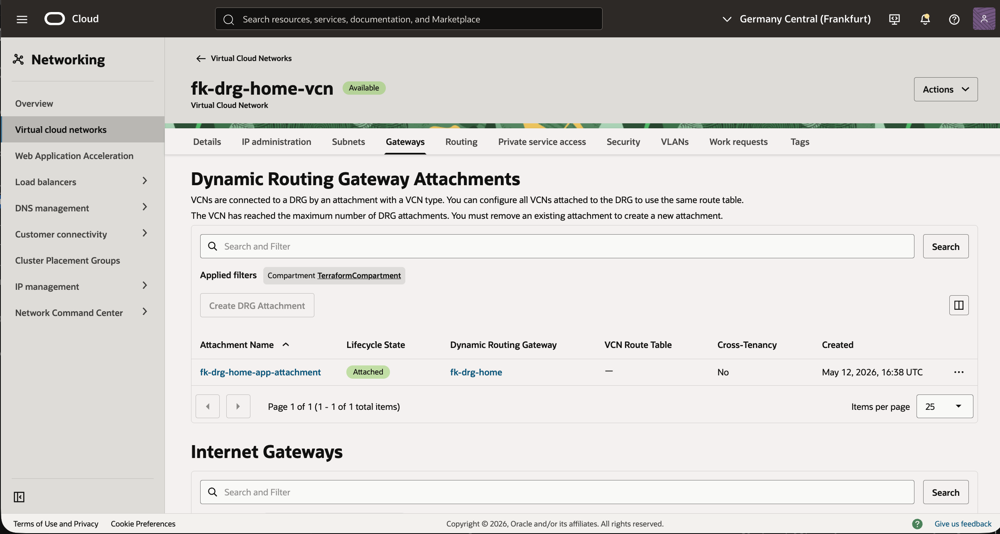

This screen shows the DRG attachment created from the home VCN to `fk-drg-home`. It confirms that the VCN side of the cross-region design is physically attached to the local DRG.

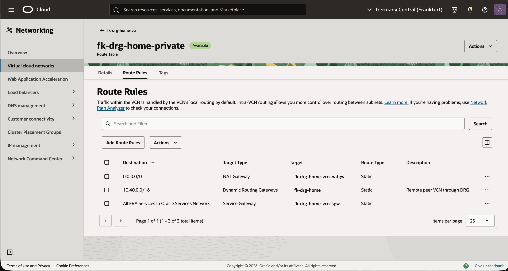

This route table view shows the three expected home-side routes: internet egress through NAT, Oracle services through the Service Gateway, and cross-region traffic to `10.40.0.0/16` through the DRG. That third route is the VCN-side entry point into the DRG-based peering path.


This view shows the custom DRG route tables created on `fk-drg-home`: `fk-drg-home-from-vcn` and `fk-drg-home-from-rpc`. They sit alongside OCI autogenerated DRG route tables, but only the named custom tables are used by this example's explicit routing logic.

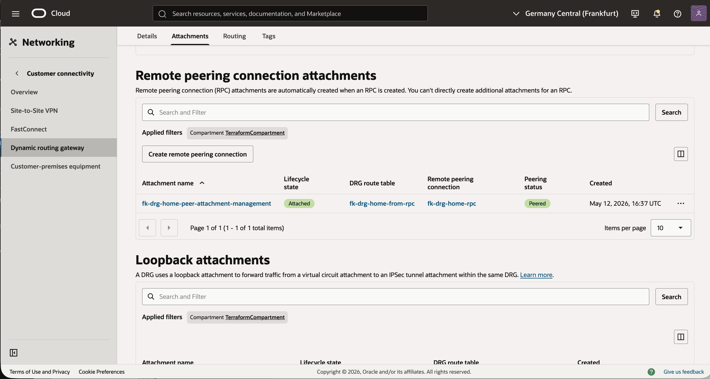

This attachment management screen confirms that the home RPC attachment is associated with `fk-drg-home-from-rpc` and that peering status is `Peered`. It is the clearest proof that the remote peering connection is active from the home-region side.

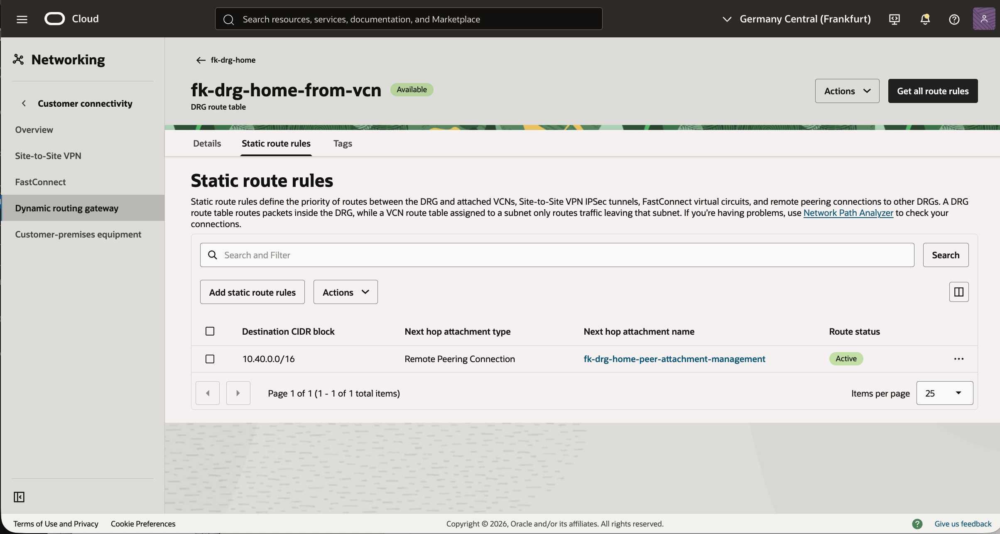

This DRG route table rule shows that traffic entering the home DRG from the local VCN is forwarded toward `10.40.0.0/16` through the RPC attachment. That is the DRG-side outbound route toward the peer region.

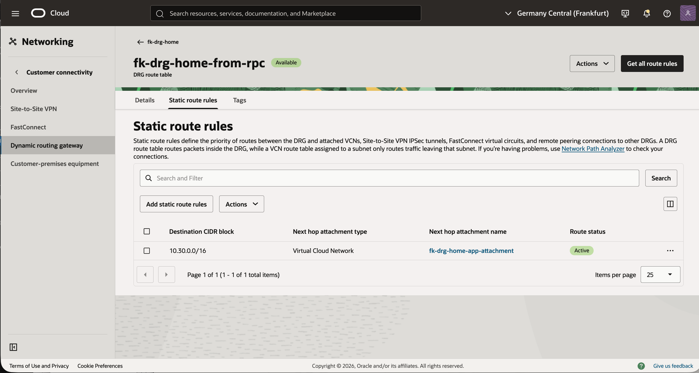

This DRG route table rule shows the return path on the home side: traffic arriving from the RPC is sent back toward the attached home VCN for `10.30.0.0/16`. Together with the previous screen, it completes the DRG-side routing logic for region one.

### Peer Region Screenshots

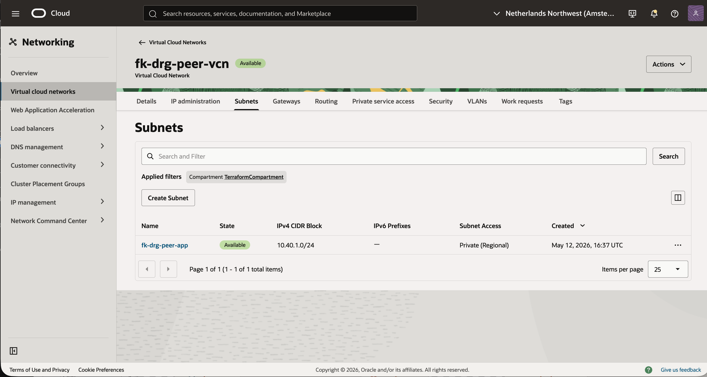

This view shows the peer-region VCN `fk-drg-peer-vcn` and the private subnet `fk-drg-peer-app`. It confirms that the second region uses the expected `10.40.0.0/16` and `10.40.1.0/24` CIDR layout.


This route table view shows the peer-side equivalent of the home setup: NAT for internet egress, Service Gateway for Oracle services, and a DRG route for `10.30.0.0/16`. That proves the peer VCN is prepared to send traffic toward the remote home region.

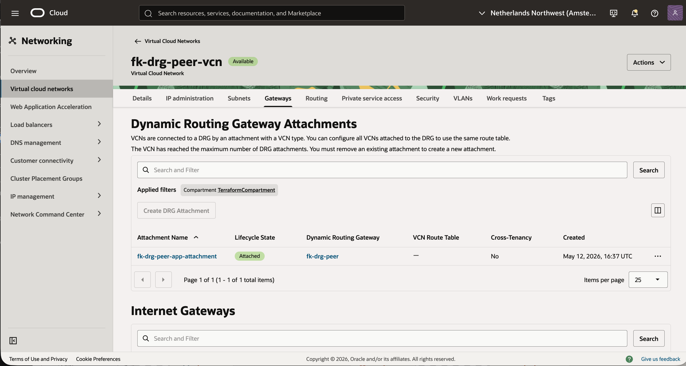

This screen shows the peer-region VCN attachment to `fk-drg-peer`. It confirms that the second VCN is attached to its local DRG and ready to participate in cross-region forwarding.

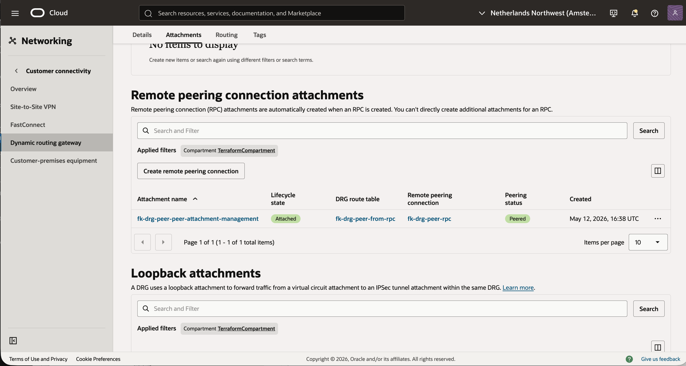

This attachment management screen confirms that the peer RPC attachment is associated with `fk-drg-peer-from-rpc` and is also in `Peered` state. That validates the remote peering from the peer-region side as well.

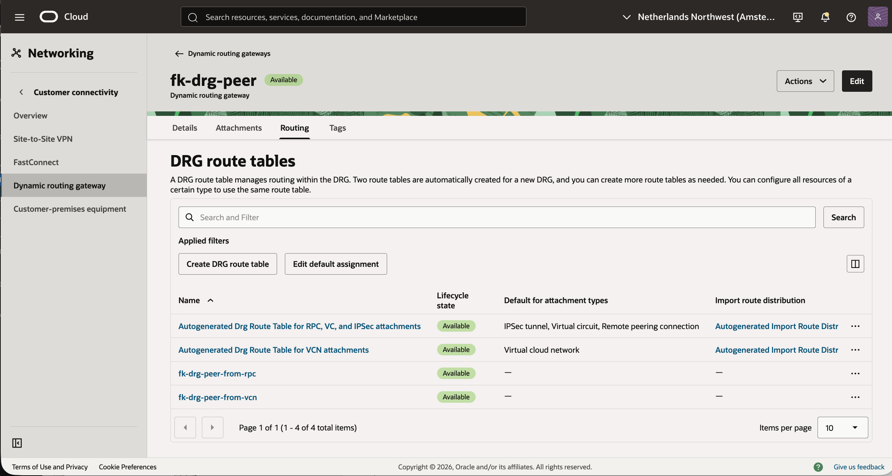

This view shows the custom DRG route tables created on `fk-drg-peer`: `fk-drg-peer-from-vcn` and `fk-drg-peer-from-rpc`. As on the home side, these are the named route tables carrying the explicit traffic policy for the example.

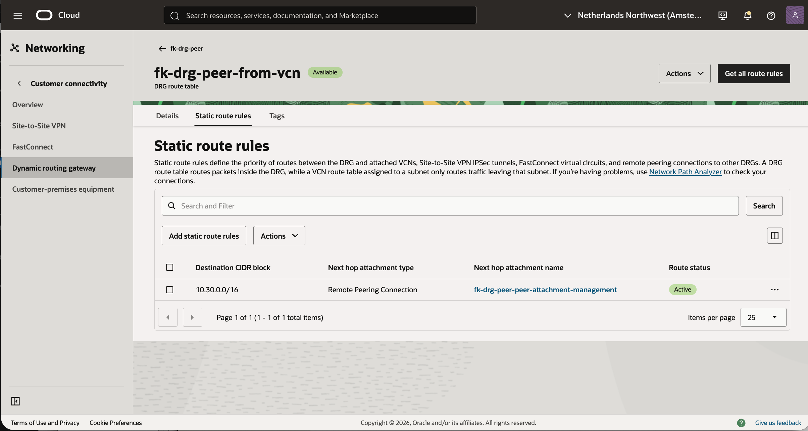

This DRG route table rule shows that peer-side traffic entering from the local VCN is forwarded toward `10.30.0.0/16` through the RPC attachment. It is the mirror image of the home-side `from-vcn` routing rule.

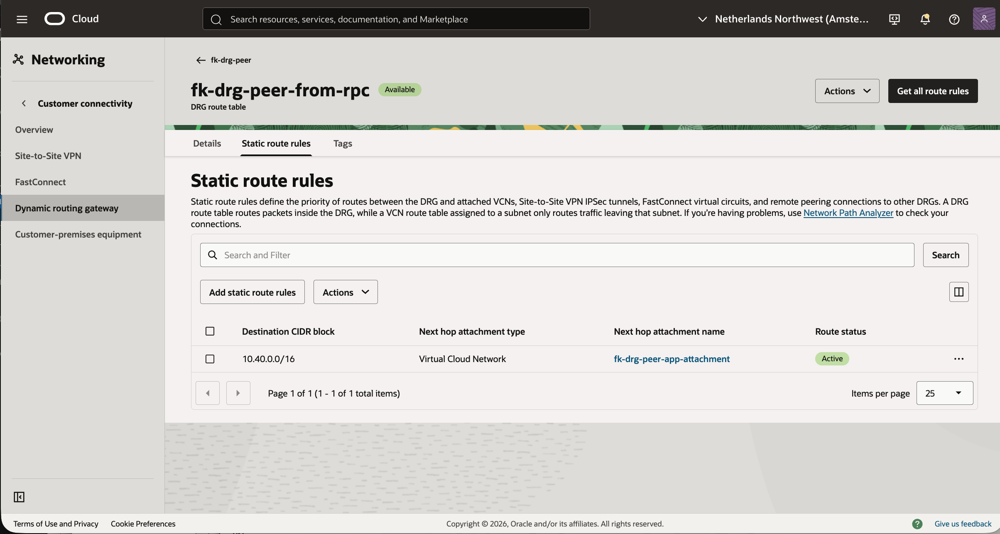

This final DRG route table rule shows the peer-side return path from RPC back to the attached peer VCN for `10.40.0.0/16`. With this rule in place, traffic arriving from the home region can exit the peer DRG into the destination VCN.

---

## 🧠 Design Notes

- This example introduces the real DRG differentiator in OCI: cross-region remote peering
- VCN route tables decide how traffic reaches the local DRG
- DRG route tables decide how traffic traverses between VCN attachments and RPC attachments
- The home-side RPC is created first, and the peer-side RPC initiates the peering to avoid a cyclic dependency in Terraform
- Associating the VCN attachment with the `from-vcn` DRG route table is essential for deterministic DRG-side forwarding

This is a practical building block for:

- multi-region OCI connectivity
- DRG transit routing scenarios
- hub-and-spoke DRG evolution
- hybrid and multicloud routing labs

---

## 🧹 Cleanup

To remove all resources created by this example:

```bash
tofu destroy
```

---

## ✅ Summary

This example demonstrates:

- how to create two DRGs in two OCI regions
- how to attach one VCN to each DRG
- how to establish RPC-based DRG remote peering
- how to model VCN-side and DRG-side routing for end-to-end cross-region traffic
- how to compose `terraform-oci-fk-vcn` with `terraform-oci-fk-drg` across multiple providers

---

## 🌐 Learn More

Visit [FoggyKitchen.com](https://foggykitchen.com/) for OCI, multicloud, and Terraform/OpenTofu learning resources.

---

## 🪪 License

Licensed under the **Universal Permissive License (UPL), Version 1.0**.  
See [LICENSE](../../LICENSE) for more details.
