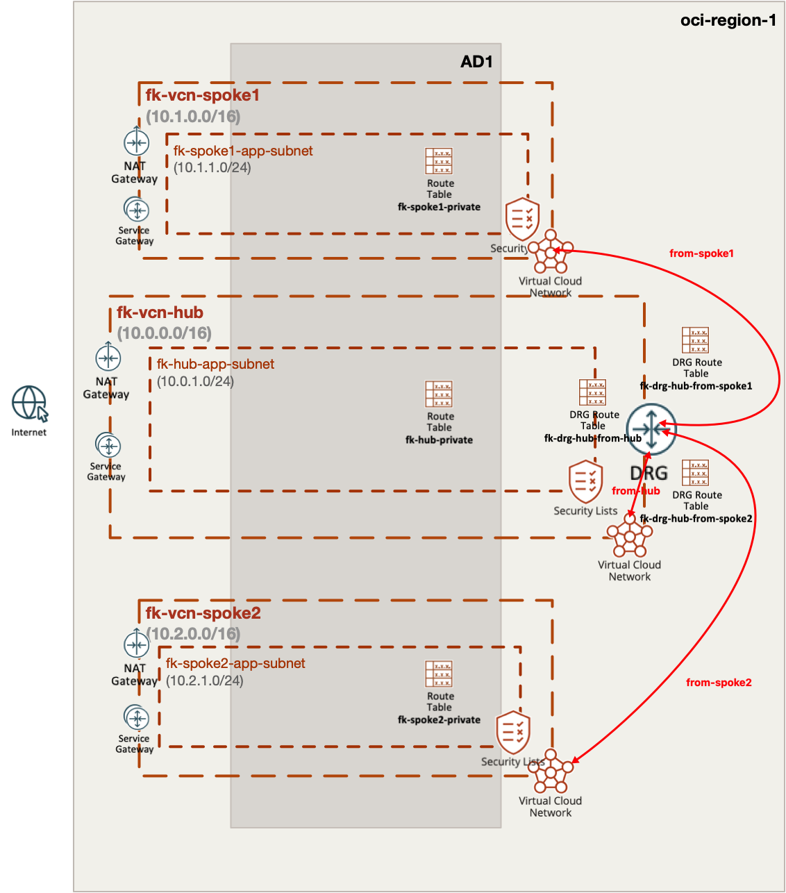
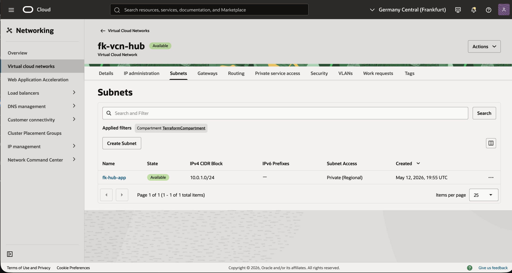
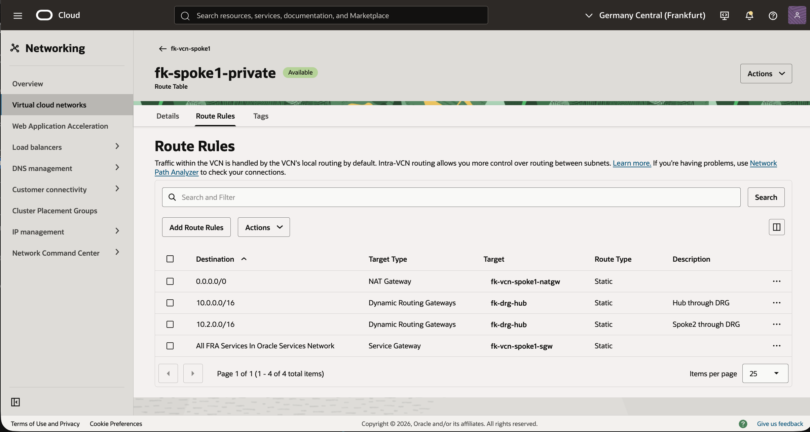
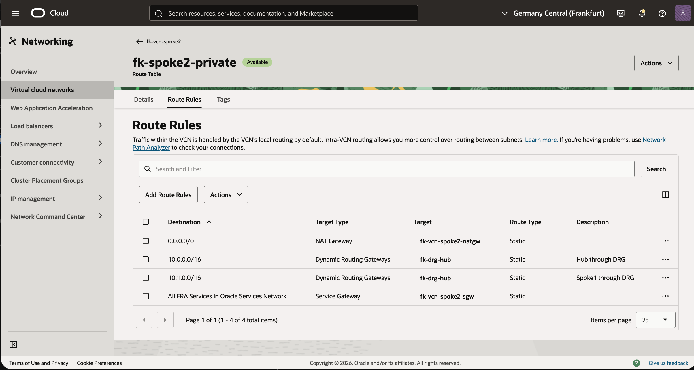
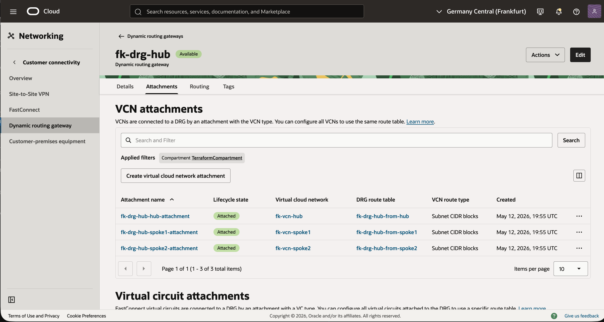
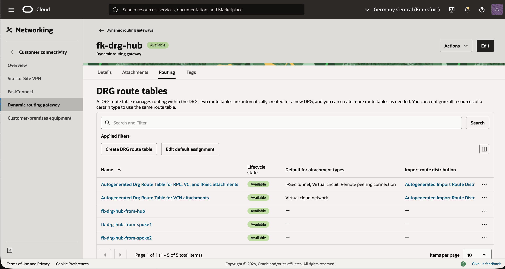
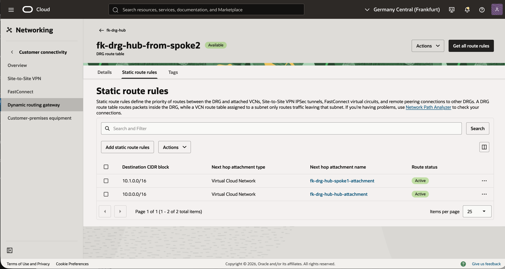
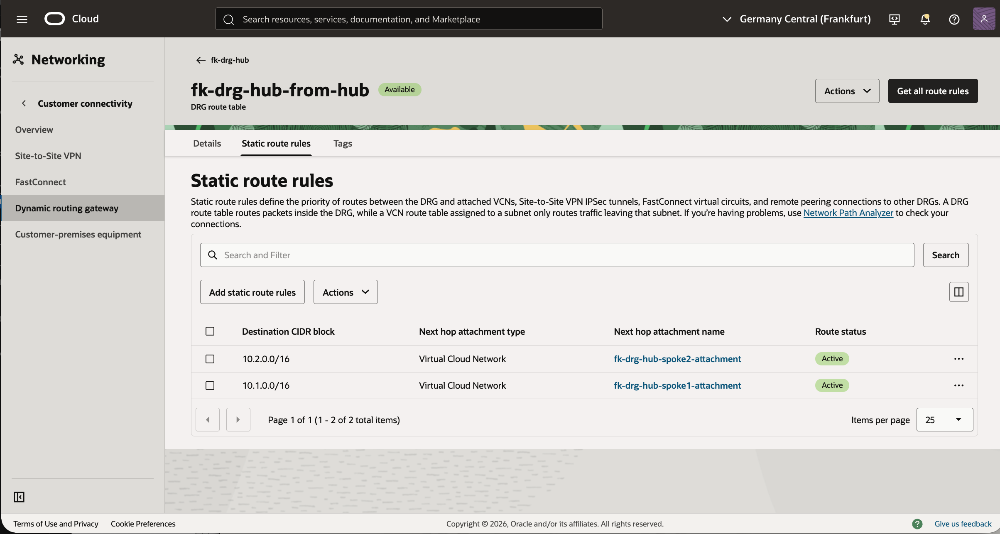

# Example 03: DRG Hub-and-Spoke Transit Routing

In this example, we deploy a **Hub-and-Spoke network topology** in Oracle Cloud Infrastructure (OCI) and use **one Dynamic Routing Gateway (DRG)** as the transit layer between three attached Virtual Cloud Networks (VCNs).

This is the natural next step after the single-attachment and cross-region examples. It shows the "DRG2" style design where one DRG serves multiple VCN attachments and performs spoke-to-spoke routing without a router VM.

---

## 🧭 Architecture Overview



This deployment creates:

- One DRG:
  - `fk-drg-hub`
- Three VCNs:
  - `fk-vcn-hub` (`10.0.0.0/16`)
  - `fk-vcn-spoke1` (`10.1.0.0/16`)
  - `fk-vcn-spoke2` (`10.2.0.0/16`)
- One private subnet in each VCN:
  - `fk-hub-app` (`10.0.1.0/24`)
  - `fk-spoke1-app` (`10.1.1.0/24`)
  - `fk-spoke2-app` (`10.2.1.0/24`)
- Three VCN attachments to the same DRG
- Three VCN private route tables that send remote VCN CIDRs into the DRG
- Three DRG route tables:
  - `from-hub`
  - `from-spoke1`
  - `from-spoke2`

With this design:

- the hub VCN can reach both spokes through the DRG
- `spoke1` can reach `spoke2` through the DRG
- `spoke2` can reach `spoke1` through the DRG
- no compute-based forwarding appliance is required

---

## Why This Is Different from Azure

This example is intentionally analogous to the Azure hub-and-spoke routing example, but OCI handles transit differently.

In Azure, the same pattern typically needs:

- VNet peering
- User Defined Routes (UDRs)
- a router VM or other forwarding appliance

In OCI, the DRG provides the transit routing function directly. That means the example can focus on:

- VCN route tables deciding which traffic enters the DRG
- DRG route tables deciding which attachment receives that traffic next

The result is a cleaner and more cloud-native transit design.

---

## 🚀 Deployment Steps

Initialize and apply the Terraform/OpenTofu configuration:

```bash
cp terraform.tfvars.example terraform.tfvars
tofu init
tofu plan
tofu apply
```

After a successful deployment, Terraform will output:

- all three VCN IDs
- the DRG ID
- the DRG attachment ID map
- the DRG route table ID map

---

## 🖼️ OCI Console Verification

After deployment, verify the following in OCI Console:

### Hub VCN
- `fk-vcn-hub` with CIDR `10.0.0.0/16`
- subnet `fk-hub-app` with CIDR `10.0.1.0/24`
- private route table `fk-hub-private`
- routes to:
  - `10.1.0.0/16` through the DRG
  - `10.2.0.0/16` through the DRG

### Spoke1 VCN
- `fk-vcn-spoke1` with CIDR `10.1.0.0/16`
- subnet `fk-spoke1-app` with CIDR `10.1.1.0/24`
- private route table `fk-spoke1-private`
- routes to:
  - `10.0.0.0/16` through the DRG
  - `10.2.0.0/16` through the DRG

### Spoke2 VCN
- `fk-vcn-spoke2` with CIDR `10.2.0.0/16`
- subnet `fk-spoke2-app` with CIDR `10.2.1.0/24`
- private route table `fk-spoke2-private`
- routes to:
  - `10.0.0.0/16` through the DRG
  - `10.1.0.0/16` through the DRG

### DRG
- one DRG named `fk-drg-hub`
- three VCN attachments:
  - `hub`
  - `spoke1`
  - `spoke2`
- three DRG route tables:
  - `fk-drg-hub-from-hub`
  - `fk-drg-hub-from-spoke1`
  - `fk-drg-hub-from-spoke2`

### DRG Route Logic
- `from-hub` sends traffic for spoke CIDRs to the correct spoke attachments
- `from-spoke1` sends `10.0.0.0/16` to `hub` and `10.2.0.0/16` to `spoke2`
- `from-spoke2` sends `10.0.0.0/16` to `hub` and `10.1.0.0/16` to `spoke1`

This confirms that the DRG is acting as a true transit hub for multiple attached VCNs.

Below is a full OCI Console walkthrough showing the key routing objects created by the example.



This view shows the hub VCN `fk-vcn-hub` and its private subnet `fk-hub-app`. It confirms the hub-side CIDR layout used as the central attachment point into the DRG.


This route table view shows the hub private route table `fk-hub-private`. It proves that the hub VCN sends both spoke CIDRs into the DRG while keeping NAT and Service Gateway routes for standard private subnet behavior.



This screen shows `fk-spoke1-private` and its routes toward the hub and `spoke2` through `fk-drg-hub`. That is the first half of the spoke-to-spoke transit configuration.



This screen shows `fk-spoke2-private` and its routes toward the hub and `spoke1` through the same DRG. Together with the previous screenshot, it confirms bidirectional VCN-side routing into the transit hub.



This attachments view shows that all three VCNs are attached to the same DRG and that each attachment is associated with its own explicit DRG route table. That is the key "DRG2" behavior this example is meant to demonstrate.



This route table list confirms that the DRG contains three custom transit route tables: `fk-drg-hub-from-hub`, `fk-drg-hub-from-spoke1`, and `fk-drg-hub-from-spoke2`. These tables define how traffic is forwarded depending on which VCN attachment it entered from.


This view shows the static route rules for `fk-drg-hub-from-spoke1`. Traffic entering the DRG from `spoke1` is forwarded either to the hub VCN or directly to `spoke2`, depending on the destination CIDR.



This view shows the static route rules for `fk-drg-hub-from-spoke2`. It mirrors the previous screen and confirms the reverse spoke-to-spoke and spoke-to-hub forwarding path.



This final screen shows the route rules for `fk-drg-hub-from-hub`. It confirms that hub-originated traffic toward either spoke is also forwarded through the correct DRG attachments.

---

## 🧠 Design Notes

- One DRG can route between multiple attached VCNs
- VCN route tables and DRG route tables remain separate concerns
- Each attachment is intentionally associated with its own DRG route table for predictable forwarding behavior
- This pattern is the OCI-native equivalent of a hub-and-spoke transit architecture without an NVA or router VM

This is a practical foundation for:

- multi-VCN east-west routing
- shared services hub patterns
- controlled hub-and-spoke segmentation
- future inspection or transit extensions

---

## 🧹 Cleanup

To remove all resources created by this example:

```bash
tofu destroy
```

---

## ✅ Summary

This example demonstrates:

- how to attach multiple VCNs to one DRG
- how to route spoke-to-spoke traffic through the DRG
- how to model hub-and-spoke transit routing in OCI
- how to build the OCI-native counterpart of Azure UDR-based hub transit

---

## 🌐 Learn More

Visit [FoggyKitchen.com](https://foggykitchen.com/) for OCI, multicloud, and Terraform/OpenTofu learning resources.

---

## 🪪 License

Licensed under the **Universal Permissive License (UPL), Version 1.0**.  
See [LICENSE](../../LICENSE) for more details.
